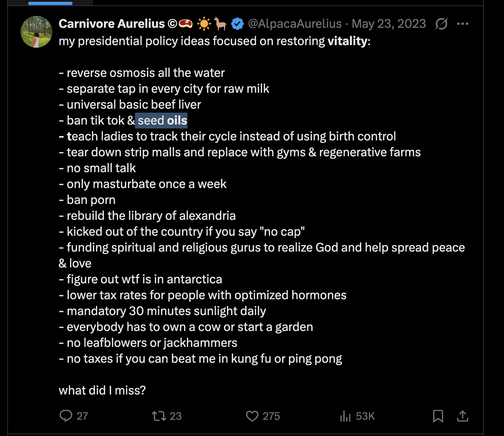
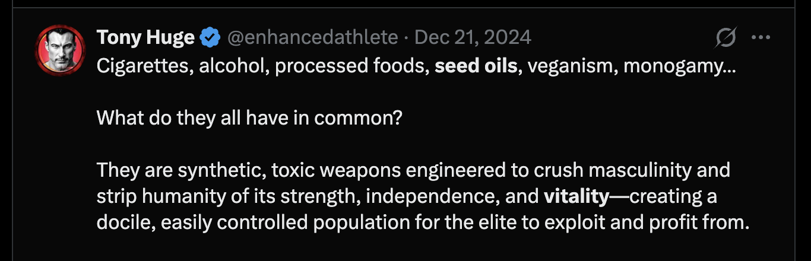
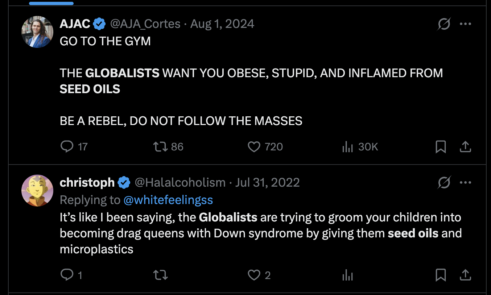
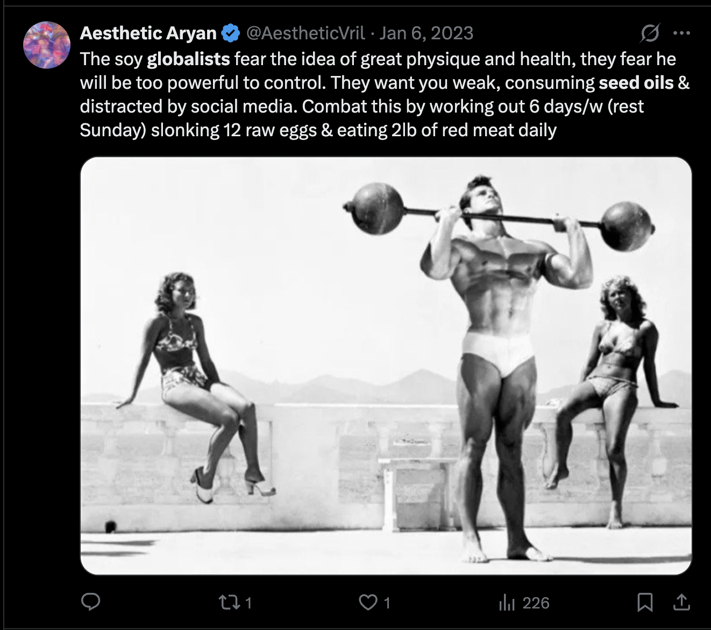

```{r setup, include=FALSE}
knitr::opts_chunk$set(echo = TRUE)
```

# **Seed Oils & Health**

By Hector Carvajal, Miles Barry, Vik Sandhu, Chelsea Nnajiofor, and Vish Kapu

### Social media paranoia

If you open Instagram Reels and search for “seed oils”, a long list of content warning social media users of the dangers of its consumption appears in a good proportion of the feed. Influencers with thousands of views warn that seed oils found in everyday meals are the source of obesity, infertility, and betray the cultural ideals of American strength. These ideas are promoted by a broad range of health experts, fitness coaches and political commentators. You may recognize figures such as RFK Jr., Joe Rogan, and Tennessee Titans Head Coach Robert Saleh. The anti-seed oil movement seems to be less about food, but tied into the fears of losing one’s health and lack of trust in the general American diet. It is also not so much that it is a medical concern, but a distinct fear of not outwardly appearing optimized or healthy to others. There is a sense of morality and individual responsibility attached to seed oils framed as nutritional advice. Certain foods are portrayed as less superior than others based on concerns on how they are believed to influence masculinity, fertility and traditional gender roles. 

### Nutrition Facts

Before we jump into the meat of the seed oil issue, first, we must understand what seed oils even are. Seed oils or vegetable oils are oils that come from a variety of vegetables and seeds, most of the common sources being [canola, corn, soybean, and sunflower oils](https://www.health.harvard.edu/heart-health/seeding-doubt-the-truth-about-cooking-oils). Vegetable oils contain polyunsaturated fats, which have been shown in historical research to contribute to heart disease compared to saturated fats from animal products (plus coconut and palm oil). But the controversy around them stems from the oil extraction process: [extracting oil requires the use of hexane](https://www.health.harvard.edu/heart-health/seeding-doubt-the-truth-about-cooking-oils), a hazardous solvent, and the oils themselves contain linoleic acid, which [converts in our bodies into a compound that promotes inflammation](https://public-health.uq.edu.au/article/2024/02/if-you%E2%80%99re-worried-about-inflammation-stop-stressing-about-seed-oils-and-focus-basics). Yet the negatives here stem from exaggerating these negative compounds. Linoleic acid may be attributed to inflammation, but there is not enough evidence to attribute the two as cause and effect. The hexane ingestion we get from consuming seed oils is not substantial enough to cause harm to the body when compared to other sources of chemicals, and the connection between saturated fats and unhealthiness can only be considered when you connect the oils with unhealthy foods that are high in fats, sugars, and salts. The oils themselves aren’t harmful, but the foods high in them, along with other harmful nutrients, are. 

### The right-wing connection

Okay — so if seed oils aren't actually proven to be unhealthy, why are so many people spreading misinformation about them online? The answer is stranger than you might expect. The further you scroll into the social-media presence of anti-seed-oil influencers, the more you encounter extreme right-wing talking points: calls for mass deportations, claims that non-white people have lower IQs, and advocacy for the mandatory sterilization of "the unfit" all run amok in these forums, side by side with discussions of PUFA and cooking oil. To understand how a discourse about health becomes a discourse about race — and how the two are not merely adjacent but structurally linked — we turn to Michel Foucault's account of biopolitics, developed in his 1975–76 lectures Society Must Be Defended.

Foucault describes a historical shift in the mechanics of power. Where the old sovereign held the right to "take life or let live," the modern state operates with the opposite logic — the power  “to ‘make’ live and ‘let’ die” (Foucault 241). It manages the vitality of the population as a whole. This inversion shifts anxiety away from sudden death by epidemic toward fear of the endemic that, in Foucault's phrase, "sapped the the population's strength" (Foucault 244).

Framing seed oil paranoia as a biopolitical movement lets us read both its proposed policies and its bodily remedies through Foucault's concepts. The argument, briefly, is that anti-seed-oil influencers frame seed oils as an endemic that weakens the population's vitality. They believe this endemic is not naturally occurring but deliberately introduced by "globalists" — a category that slides between the [World Economic Forum](https://drive.google.com/file/d/1V_D7jmjQSH8FiPXZKIHIsORUN0u1buq2/view?usp=sharing), [Big Pharma](https://drive.google.com/file/d/1r7xvKiyGhkIiow2ZNXm9UDBhGWxri7Kb/view?usp=sharing), and [Jews](https://drive.google.com/file/d/1AxqkN-Fe_YKDWPYIImJ9OvCg6BftrFY8/view?usp=sharing). The movement's two governing impulses, the cultivation of vitality and the expulsion of the globalist, map directly onto Foucault's formula of make live and let die.

**Seed Oils as Endemic**

Seed oils are figured as an endemic in the grammar these influencers use. [They warn of](https://raypeat.com/articles/articles/unsaturated-oils.shtml) chronic inflammation, altered hormones, and a weakened immune system — conditions that do not kill quickly but gradually make individual bodies, and the nation, weaker. 

**Vitality:** 

Vitality is pursued first at the level of the individual body through an elaborate disciplinary regime. [AJAC's instruction](https://drive.google.com/file/d/1A-Rm0-YqeIr-22k2MqPlbxZIs62s1ALe/view?usp=sharing) is simply "GO TO THE GYM"; [Aesthetic Aryan](https://drive.google.com/file/d/10fs6z07QJCnzD5PfxNDZm2e5GORdFkT3/view?usp=sharing) prescribes working out six days a week, "slonking 12 raw eggs," and eating two pounds of red meat daily; [Brandon ](https://drive.google.com/file/d/1V_D7jmjQSH8FiPXZKIHIsORUN0u1buq2/view?usp=sharing)counsels his followers to "fix your ratios," "eat nose-to-tail," "lift heavy," and "get sunlight." This is Foucault's disciplinary technology of the body, the individual takes extreme measures to build and maintain strength, masculinity, and hormonal optimization. The same norm scales upward to the population. [Carnivore Aurelius](https://drive.google.com/file/d/1LBi58CC9p8CFv0p1HoWf6rfbf5up8V25/view?usp=sharing)'s mock-presidential platform — "policy ideas focused on restoring vitality" — proposes to ban seed oils, teach women "to track their cycle instead of using birth control," replace strip malls with "gyms & regenerative farms," mandate thirty minutes of daily sunlight, and grant "lower tax rates for people with optimized hormones." In other words, the state must sort its citizens by biological fitness. 

{width="454"}

{width="623"}

**Globalists**

If vitality is the life the movement seeks to cultivate, the globalist is the force it must expel to do so. According to these influencers, globalists "[want to keep us sick](https://drive.google.com/file/d/1AxqkN-Fe_YKDWPYIImJ9OvCg6BftrFY8/view?usp=sharing)". They are ["in bed with WEF and PHARMA](https://drive.google.com/file/d/1r7xvKiyGhkIiow2ZNXm9UDBhGWxri7Kb/view?usp=sharing)". They wish to "[get rid of independent farmers](https://drive.google.com/file/d/1AxqkN-Fe_YKDWPYIImJ9OvCg6BftrFY8/view?usp=sharing)" and keep the public "eating UPF's full of junk, seed oils & sugar" so that "big pharma will keep on making huge profits". The globalist is, with only the thinnest coding, a racial figure — the "[(((globalists)))](https://drive.google.com/file/d/1AxqkN-Fe_YKDWPYIImJ9OvCg6BftrFY8/view?usp=sharing)" of Nazi shorthand, the enemy of "Aesthetic Aryan." 

{width="564"}

{width="466"}

This is where Foucault's account of state racism becomes indispensable. Racism, he argues, introduces a caesura into the population — a break dividing the life that must flourish from the life that may be eliminated — and recasts killing not as warfare but as biological purification (Foucault 255). It is this logic that resolves why seed-oil paranoia runs alongside calls for mass deportation: the project of making the chosen population purer and more vigorous structurally demands a mechanism for identifying and removing the contaminant. "Training for mass deportations" and "sterilization of the unfit" are therefore not a separate, darker turn but the necessary "let die" that the fantasy of dietary rebirth was always going to require. 

### Social determinants of health

By now you’ve likely spent some time on social media seeing people talk about seed oils. Chances are, you have encountered influencers, fitness creators, or general wellness accounts often warning their followers against oils such as canola, soybean, and sunflower oil, claiming that they cause inflammation in the body and cause poor health in individuals. Many people who avoid seed oils do so because they have been exposed to health and wellness content that presents seed oils as a major cause of concern regarding someone’s health. However, the concept of social determinants of health from Inflamed argues that health is influenced by far more than diet alone. Factors such as where people live, how much stress they experience, the quality of their environment and the access to resources can all affect a person's health. This raises some interesting questions such as, what do people think about when they hear about seed oils? To reach some conclusion, members of our team spoke with multiple individuals and asked them about their understanding of seed oils , where they heard about them, and most importantly, if they believed it affected their health. Overall, most participants that we interviewed have heard of the term seed oils, but could not explain why they are considered harmful. For most, seed oils simply are not something they spend much time thinking about, and instead view seed oils as just another topic that occasionally appears in health conversations. 
